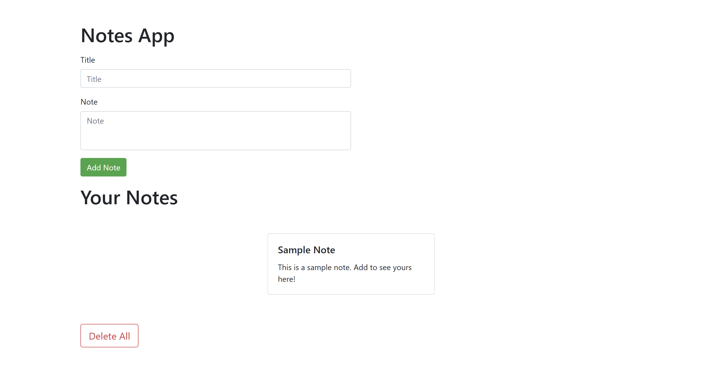

# Notes App

A simple web application for taking and managing notes. This app allows users to add, view, and delete notes.

## Usage

1. Open the `index.html` file in a web browser.
2. Enter a title and note in the respective input fields.
3. Click the "Add Note" button to add the note.
4. Your added notes will be displayed below the input form.
5. To delete a specific note, click the "Delete" button on the corresponding note.
6. To delete all notes, click the "Delete All" button.

## Technologies Used

- HTML
- JavaScript
- Bootstrap

## Features

- Add and store notes locally in the browser.
- View and delete individual notes.
- Delete all notes with a single click.
